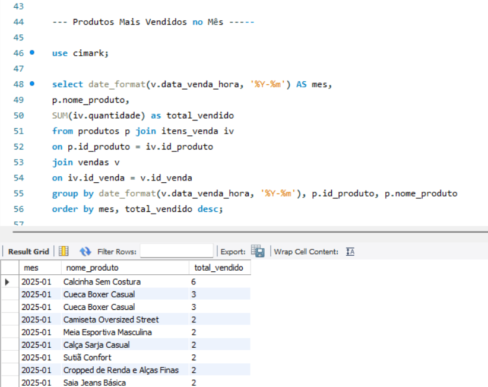
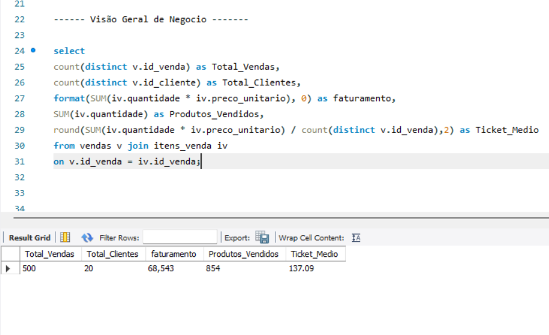

# Sales-Analytics - Análise de Dados de um E-commerce  
<div align="left">
  
  
  
</div>


<br>

# 💡 Sobre o Projeto

Este projeto foi desenvolvido para simular um ambiente de vendas de um e-commerce utilizando um banco de dados relacional em MySQL. 

O objetivo foi aplicar conceitos de modelagem de dados, SQL, e análise de dados em um cenário próximo ao encontrado em aplicações comerciais, desde a criação da estrutura do banco que se nomeia como cimark, até a obtenção de insights por meio de consultas analíticas.

Durante o desenvolvimento, o projeto foi organizado em etapas para facilitar a manutenção,  reutilização dos scripts e a evolução da solução.


<table width="100%"> 
<tr>
<td width="50%" valign="top" style="border: 1px solid #30363d; border-radius: 6px; padding: 15px;">

## ⚙️ Desenvolvimento

Ao longo do projeto foram aplicados conceitos fundamentais de banco de dados, incluindo:

  📝 **DDL** (Data Definition Language) para criação do banco de dados, tabelas, chaves primárias, chaves estrangeiras e restrições de integridade.
  
  📥 **DML** (Data Manipulation Language) para inserção e manipulação dos dados utilizados nas análises.

  🔗 Relacionamentos entre tabelas para representar operações de um fluxo real de vendas.

  📁 Organização dos scripts SQL em etapas para facilitar a manutenção e reutilização do projeto.

  </td>

<td width="2%"></td>
 <td widhth="48%" valign="top" style="border: 1px solid #30363d; border-radius: 6px; padding: 15px;">

## 📊 Análises Desenvolvidas
Com a base de dados finalizada, foram desenvolvidas consultas SQL para responder perguntas de negócio, como:


📦 Produtos mais vendidos;

💰 Faturamento por categoria;

👨‍💼 Desempenho dos vendedores;

🛒 Ticket médio;

👥 Clientes com maior volume de compras;

📈 Evolução das vendas.

</td>
</tr>
</table>


<br>

## 🛠️ Tecnologias Utilizadas

O projeto foi desenhado utilizando ferramentas padrão de mercado para simular um pipeline real de análise de dados, desde a modelagem e estruturação até a entrega de insights estratégicos.

*   **Modelagem & Administração:** `MySQL Workbench` para a criação do diagrama Entidade-Relacionamento (DER), engenharia direta e administração do banco de dados local.
*   **Manipulação & Análise de Dados:** `SQL` (Structured Query Language) para a escrita de consultas analíticas complexas, utilizando junções (JOINs), agregações, subqueries e CTEs para extrair métricas de negócio.
*   **Visualização & Business Intelligence (Em breve):** `Microsoft Excel` para conexão direta com o banco de dados via Power Query, criação de tabelas dinâmicas e desenvolvimento de um dashboard interativo focado em tomadores de decisão. 

<br>

## 📐 Modelo Relacional (DER)

Abaixo está a representação visual da modelagem do nosso banco de dados, planejada para garantir a integridade referencial e otimizar as consultas analíticas de vendas.


> 📌 **Nota de Evolução do Projeto:** 
> O diagrama acima apresenta a **arquitetura e modelagem inicial** do banco de dados. Para enriquecer as análises de negócios (Business Intelligence), o modelo foi expandido posteriormente com a inclusão de novas colunas estratégicas nas tabelas como `cliente` (como gênero, data de nascimento e localização) e `vendas` (forma de pagamento), permitindo cruzamentos financeiros e geográficos mais profundos.

---

### 🗃️ Entendendo a Estrutura e os Relacionamentos

A arquitetura do banco foi desenhada seguindo as melhores práticas de normalização para evitar redundâncias, estruturando-se a partir de cinco entidades principais:

1. **Vendas (Tabela Fato/Central):** 
   * Centraliza as transações financeiras e conecta quem comprou (`id_cliente`) e quem vendeu (`id_vendedor`).
   * Possui um relacionamento de **1:N (Um para Muitos)** com as tabelas de Clientes e Vendedores, garantindo que toda venda pertença obrigatoriamente a um cliente e vendedor válidos.

2. **Itens da Venda (Tabela de Detalhes):**
   * Funciona como a tabela pivot de relacionamento entre `vendas` e `produtos`.
   * Registra a quantidade e o preço unitário praticado no momento exato da compra, preservando o histórico financeiro mesmo se o preço do produto sofrer alterações futuras na tabela principal.

3. **Clientes & Vendedores (Dimensões de Atores):**
   * Armazenam dados cadastrais e de contato. Com a evolução do modelo, passaram a contar com colunas de localização (`cidade` e `estado`) para possibilitar análises regionais de desempenho de vendas e comportamento de consumo.

4. **Produtos & Categorias (Dimensões de Catálogo):**
   * Organizados de forma hierárquica, onde cada produto é associado a uma categoria específica (`id_categoria`), permitindo a classificação do faturamento e ticket médio por grupos de produtos.

<br>

## 🗂️ Estrutura do Projeto

```text
sales-analytics/
├── assets/
│   └── modelo_relacional.png
├── scripts/
│   ├── 01_criacao_banco.sql
│   ├── 02_insercao_dados.sql
│   ├── 03_consultas_analiticas.sql
│   └── 04_validacao_dados.sql
└── README.md
 ```


| Arquivo | Descrição |
| :--- | :--- |
| `modelo_relacional.png` | Imagem do Modelo Relacional (DER) do banco de dados |
| `01_criacao_banco.sql` | Script de criação das tabelas e definição da estrutura do banco |
| `02_insercao_dados.sql` | Script para inserção da carga inicial de dados |
| `03_consultas_analiticas.sql` | Consultas SQL para análise de dados e métricas de vendas |
| `04_validacao_dados.sql` | Script para validação e consistência dos dados inseridos |
| `README.md` | Documentação principal do projeto |

<br>

## 🕹️ Como Executar o Projeto

Clone o repositório e execute os scripts **nesta ordem** no seu terminal ou cliente MySQL (substituindo `seu_usuario` e `nome_do_banco` pelos seus dados):

```bash
# 1. Criar a estrutura do banco de dados
mysql -u seu_usuario -p nome_do_banco < scripts/01_criacao_banco.sql

# 2. Inserir os dados iniciais
mysql -u seu_usuario -p nome_do_banco < scripts/02_insercao_dados.sql

# 3. Executar as consultas analíticas de vendas
mysql -u seu_usuario -p nome_do_banco < scripts/03_consultas_analiticas.sql

```

Depois, para validar se tudo foi carregado corretamente, rode o script de validação:

```bash
mysql -u seu_usuario -p nome_do_banco < scripts/04_validacao_dados.sql
```

<br>

## 📈 Exemplos de Análise e Resultados

As consultas analíticas foram mapeadas no script `03_consultas_analiticas.sql` e estruturadas para responder a perguntas estratégicas de negócio, divididas em quatro pilares principais.

### 1. Desempenho de Produtos e Estoque

Foco em identificar os produtos mais relevantes para o faturamento e monitorar a saúde do estoque.

**ANÁLISE 1: PRODUTO MAIS VENDIDO NO PERÍODO**

```sql
SELECT produtos.nome_produto,
       SUM(itens_venda.quantidade) AS total_vendido
FROM produtos
JOIN itens_venda
ON produtos.id_produto = itens_venda.id_produto
GROUP BY produtos.id_produto, produtos.nome_produto
ORDER BY total_vendido DESC;
```

**Resultado da análise:**

Esta consulta identifica os produtos com maior volume de vendas no período, permitindo reconhecer os itens de maior demanda. Essas informações auxiliam na gestão de estoque, no planejamento de compras e na definição de estratégias comerciais.

**Resultado da consulta:**



---

### 2. Análise Temporal e Faturamento

Foco em acompanhar a evolução das vendas ao longo do tempo, identificando tendências, sazonalidades e o desempenho financeiro do negócio.

**ANÁLISE 6: FATURAMENTO MENSAL**

```sql
SELECT DATE_FORMAT(v.data_venda_hora, '%Y-%m') AS mes,
       SUM(iv.quantidade * iv.preco_unitario) AS faturamento
FROM vendas v
JOIN itens_venda iv
ON v.id_venda = iv.id_venda
GROUP BY mes
ORDER BY mes;
```

**Resultado da análise:**

Esta consulta apresenta a evolução do faturamento mensal, permitindo identificar períodos de crescimento ou queda nas vendas. A análise contribui para o acompanhamento do desempenho financeiro e para o planejamento de ações estratégicas.

**Resultado da consulta:**


---

### 3. Métricas de Clientes, Vendedores e Pagamentos

Avaliação da produtividade da equipe de vendas, do comportamento dos clientes e das preferências de pagamento.

**ANÁLISE 12: CLIENTES ACIMA DA MÉDIA DE COMPRAS**

```sql
SELECT c.nome,
       COUNT(v.id_venda) AS quantidade_comprada
FROM clientes c
JOIN vendas v
ON c.id_cliente = v.id_cliente
GROUP BY c.id_cliente, c.nome
HAVING COUNT(v.id_venda) >
(
    SELECT AVG(total_compras)
    FROM (
        SELECT COUNT(id_venda) AS total_compras
        FROM vendas
        GROUP BY id_cliente
    ) AS media_clientes
)
ORDER BY quantidade_comprada DESC;
```

**Resultado da análise:**

Esta consulta identifica os clientes que realizaram um número de compras superior à média da base. Esses consumidores representam um público de maior recorrência e podem ser priorizados em estratégias de fidelização e relacionamento.

**Resultado da consulta:**


---

### 4. Visão Geral do Negócio (Dashboard SQL)

Consolidação dos principais indicadores de desempenho (KPIs), fornecendo uma visão executiva da saúde financeira e operacional do negócio.

**ANÁLISE 15: RESUMO GERAL DO NEGÓCIO**

```sql
SELECT
    COUNT(DISTINCT v.id_venda) AS Total_Vendas,
    COUNT(DISTINCT v.id_cliente) AS Total_Clientes,
    FORMAT(SUM(iv.quantidade * iv.preco_unitario), 0) AS faturamento,
    SUM(iv.quantidade) AS Produtos_Vendidos,
    ROUND(SUM(iv.quantidade * iv.preco_unitario) / COUNT(DISTINCT v.id_venda), 2) AS Ticket_Medio
FROM vendas v
JOIN itens_venda iv
ON v.id_venda = iv.id_venda;
```

**Resultado da análise:**

Esta consulta reúne os principais indicadores do negócio em uma única visão, apresentando o total de vendas, clientes atendidos, faturamento, quantidade de produtos vendidos e ticket médio. O resultado facilita o acompanhamento do desempenho geral da empresa e apoia a tomada de decisões estratégicas.

**Resultado da consulta:**



<br>

## 📌 Conclusão

Este projeto demonstra a aplicação prática de SQL na modelagem de banco de dados, manipulação de informações e desenvolvimento de consultas analíticas voltadas ao suporte à tomada de decisão.

Por meio das análises realizadas, foi possível transformar dados de vendas em informações estratégicas, evidenciando competências em modelagem de dados, consultas SQL e análise de indicadores de negócio.

<br>


## 👩‍💻 Autora

**Cibele Nasareth**

Estudante de Sistemas de Informação, dedicada ao desenvolvimento de projetos de Análise de Dados, com habilidades em SQL, MySQL, Python e Excel.

- **LinkedIn**: https://www.linkedin.com/in/cibele-nasareth-509005272/ 
- **GitHub**: https://github.com/cibele-nasareth 

