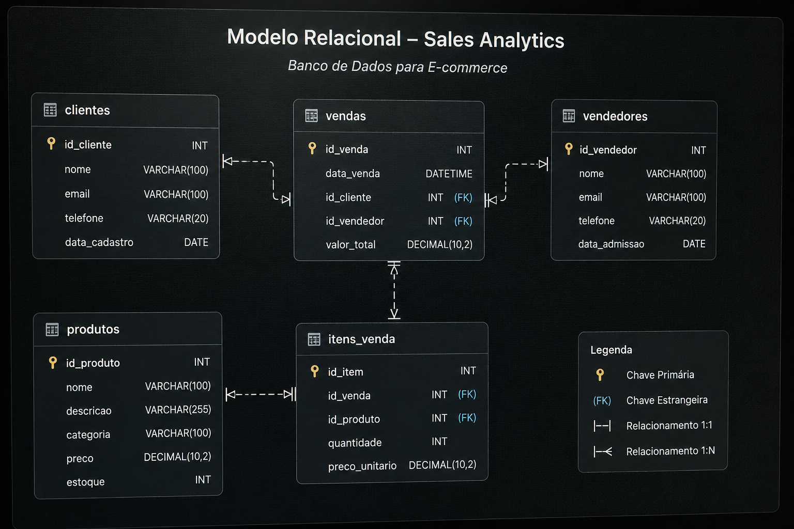

# Sales-Analytics - Análise de Dados de um E-commerce  

  
  
  

 

# 💡 Sobre o Projeto

Este projeto foi desenvolvido para simular um ambiente de vendas de um e-commerce utilizando um banco de dados relacional em MySQL. 

O objetivo foi aplicar conceitos de modelagem de dados, SQL, e análise de dados em um cenário próximo ao encontrado em aplicações comerciais, desde a criação da estrutura do banco até a obtenção de insights por meio de consultas analíticas.

Durante o desenvolvimento, o projeto foi organizado em etapas para facilitar a manutenção,  reutilização dos scripts e a evolução da solução.

<table width="100%"> 
<tr>
<td width="50%" valign="top" style="border: 1px solid #30363d; border-radius: 6px; padding: 15px;">

## ⚙️ Desenvolvimento

Ao longo do projeto foram aplicados conceitos fundamentais de banco de dados, incluindo:

  📝 **DDL** (Data Definition Language) para criação do banco de dados, tabelas, chaves primárias, chaves estrangeiras e restrições de integridade.
  
  📥 **DML** (Data Manipulation Language) para inserção e manipulação dos dados utilizados nas análises.

  🔗 Relacionamentos entre tabelas para representar operações de um fluxo real de vendas.

  📁 Organização dos scripts SQL em etapas para facilitar a manutenção e reutilização do projeto.

  </td>

<td width="2%"></td>
 <td widhth="48%" valign="top" style="border: 1px solid #30363d; border-radius: 6px; padding: 15px;">

## 📊 Análises Desenvolvidas
Com a base de dados finalizada, foram desenvolvidas consultas SQL para responder perguntas de negócio, como:

📦 Produtos mais vendidos;

💰 Faturamento por categoria;

👨‍💼 Desempenho dos vendedores;

🛒 Ticket médio;

👥 Clientes com maior volume de compras;

📈 Evolução das vendas.

</td>
</tr>
</table>

 

# 🛠️ Tecnologias Utilizadas

O projeto foi desenhado utilizando ferramentas padrão de mercado para simular um pipeline real de análise de dados, desde a modelagem e estruturação até a entrega de insights estratégicos.

*   **Modelagem & Administração:** `MySQL Workbench` para a criação do diagrama Entidade-Relacionamento (DER), engenharia direta e administração do banco de dados local.
*   **Manipulação & Análise de Dados:** `SQL` (Structured Query Language) para a escrita de consultas analíticas complexas, utilizando junções (JOINs), agregações, subqueries e CTEs para extrair métricas de negócio.
*   **Visualização & Business Intelligence (Em breve):** `Microsoft Excel` para conexão direta com o banco de dados via Power Query, criação de tabelas dinâmicas e desenvolvimento de um dashboard interativo focado em tomadores de decisão. 

 

## 📐 Modelo Relacional (DER)

Abaixo está a representação visual da modelagem do nosso banco de dados, planejada para garantir a integridade referencial e otimizar as consultas analíticas de vendas.

> 📌 **Nota de Evolução do Projeto:** 
> O diagrama acima apresenta a **arquitetura e modelagem inicial** do banco de dados. Para enriquecer as análises de negócios (Business Intelligence), o modelo foi expandido posteriormente com a inclusão de novas colunas estratégicas nas tabelas como `cliente` (como gênero, data de nascimento e localização) e `vendas` (forma de pagamento), permitindo cruzamentos financeiros e geográficos mais profundos.

---

### 🗂️ Entendendo a Estrutura e os Relacionamentos

A arquitetura do banco foi desenhada seguindo as melhores práticas de normalização para evitar redundâncias, estruturando-se a partir de cinco entidades principais:

1. **Vendas (Tabela Fato/Central):** 
   * Centraliza as transações financeiras e conecta quem comprou (`id_cliente`) e quem vendeu (`id_vendedor`).
   * Possui um relacionamento de **1:N (Um para Muitos)** com as tabelas de Clientes e Vendedores, garantindo que toda venda pertença obrigatoriamente a um cliente e vendedor válidos.

2. **Itens da Venda (Tabela de Detalhes):**
   * Funciona como a tabela pivot de relacionamento entre `vendas` e `produtos`.
   * Registra a quantidade e o preço unitário praticado no momento exato da compra, preservando o histórico financeiro mesmo se o preço do produto sofrer alterações futuras na tabela principal.

3. **Clientes & Vendedores (Dimensões de Atores):**
   * Armazenam dados cadastrais e de contato. Com a evolução do modelo, passaram a contar com colunas de localização (`cidade` e `estado`) para possibilitar análises regionais de desempenho de vendas e comportamento de consumo.

4. **Produtos & Categorias (Dimensões de Catálogo):**
   * Organizados de forma hierárquica, onde cada produto é associado a uma categoria específica (`id_categoria`), permitindo a classificação do faturamento e ticket médio por grupos de produtos.